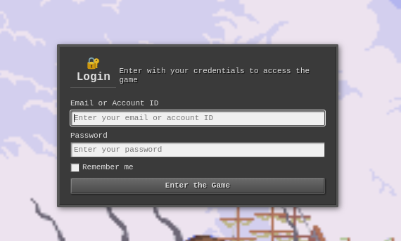
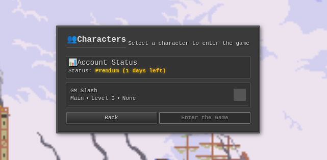

[](https://github.com/edubart/otclient/actions/workflows/build-vcpkg.yml) [](https://gitter.im/edubart/otclient?utm_source=badge&utm_medium=badge&utm_campaign=pr-badge&utm_content=badge) [](https://www.codetriage.com/edubart/otclient)

### OTClient + WebView with Chromium Embedded Framework (CEF)

This is the default OTClient with the addition of a powerful WebView feature. It allows building UI 
components in OTClient using web technologies and is fully compatible with HTML, CSS, and JavaScript.

The WebViews are provided by CEF using OSR (off-screen rendering), which renders the buffer that would
normally be displayed by the browser.

## How to build (Ubuntu 24)

- Download and install CEF. It's needed to be specific version 103.0 (automated script is available `setup_cef.sh`)
- Same procedure as build regular OTClient, but when preparing the build with cmake you need to set USE_CEF=ON:
  - `cmake -DUSE_CEF=ON ..`

## TODO

### Completed

- [x] Basic CEF integration in OTClient
- [x] Basic HTML/CSS rendering
- [x] CEF installation and compilation helpers
- [x] Mouse interaction with the component
- [x] Keyboard interaction with the component
- [x] Performance optimization (texture caching, frame rate control)
- [x] Integrate webviews with otclient filesystem through otclient://
- [x] Basic integration through callbacks between Lua and JS

### Pending

- [ ] Dynamically build components to be expose for webviews on otclient://webviews
- [ ] Touchscreen interaction with the component
- [ ] Implementation (bridge) of all available callbacks/methods in Lua also for JavaScript
- [ ] Developer tools integration (F12 debugger)
- [ ] Code readibility (clean-code geeks happy)
- [ ] Windows builds (vcpkg probably)

### HTTP Login Component

The HTTP Login component demonstrates WebView capabilities by replacing the traditional TCP login with HTTP-based authentication. It supports JWT tokens (if server supports) with fallback to username/password for the final game connection.

**Requirements:**
- [OTClient HTTP Login Server](https://github.com/LeandroPerrotta/otclient-http-login-server) (Node.js application)

**Configuration:**
- Enable/disable in `init.lua`: `useLoginHttp = true/false`
- Configure API URL in `modules/client_http_entergame/http_entergame.lua`: `baseUrl = "https://your-api-url"`




### What is OTClient?

OTClient is an alternative Tibia client for usage with otserv. It aims to be complete and flexible,
for that it uses LUA scripting for all game interface functionality and configurations files with a syntax
similar to CSS for the client interface design. OTClient works with a modular system, this means
that each functionality is a separated module, giving the possibility to users modify and customize
anything easily. Users can also create new mods and extend game interface for their own purposes.
OTClient is written in C++11 and heavily scripted in lua.

For a server to connect to, you can build your own with the [forgottenserver](https://github.com/otland/forgottenserver)
or connect to one listed on [otservlist](https://otservlist.org/).

### Where do I download?

Compiled for Windows can be found here (but can be outdated):
* [Windows Builds](http://otland.net/threads/otclient-builds-windows.217977/)

**NOTE:** You will need to download spr/dat files on your own and place them in `data/things/VERSION/` (i.e: `data/things/1098/Tibia.spr`)

### Features

Beyond of it's flexibility with scripts, OTClient comes with tons of other features that make possible
the creation of new client side stuff in otserv that was not possible before. These include,
sound system, graphics effects with shaders, modules/addons system, animated textures,
styleable user interface, transparency, multi language, in game lua terminal, an OpenGL 1.1/2.0 ES engine that make possible
to port to mobile platforms. OTClient is also flexible enough to
create tibia tools like map editors just using scripts, because it wasn't designed to be just a
client, instead OTClient was designed to be a combination of a framework and tibia APIs.

### Compiling

In short, if you need to compile OTClient, follow these tutorials:
* [Compiling on Linux](https://github.com/edubart/otclient/wiki/Compiling-on-Linux)
* [Compiling on OS X](https://github.com/edubart/otclient/wiki/Compiling-on-Mac-OS-X)

### Windows Builds with vcpkg and Visual Studio 2022 (Updated)

**Prerequisites:**
- Visual Studio 2022 with v142 toolset (MSVC 2019 build tools)
- CMake 3.16+
- Git

**Setup vcpkg:**
```bash
git clone https://github.com/Microsoft/vcpkg.git C:\vcpkg
C:\vcpkg\bootstrap-vcpkg.bat
setx VCPKG_ROOT C:\vcpkg
```

**Create v142 triplet:**
```bash
# Create C:\vcpkg\triplets\x64-windows-v142.cmake
set(VCPKG_TARGET_ARCHITECTURE x64)
set(VCPKG_CRT_LINKAGE dynamic)
set(VCPKG_LIBRARY_LINKAGE dynamic)
set(VCPKG_PLATFORM_TOOLSET v142)
```

**Install dependencies:**
```bash
vcpkg install --triplet=x64-windows-v142
```

**Build:**
```bash
mkdir build && cd build
cmake .. -G "Visual Studio 17 2022" -A x64 -T v142 -DCMAKE_TOOLCHAIN_FILE="%VCPKG_ROOT%/scripts/buildsystems/vcpkg.cmake" -DVCPKG_TARGET_TRIPLET=x64-windows-v142
cmake --build . --config RelWithDebInfo --parallel
```

**Note:** The v142 toolset is required for compatibility. VS 2022 defaults to v143 which has linking issues with this project.

### Build and run with Docker

To build the image:

```sh
docker build -t edubart/otclient .
```

To run the built image:

```sh
# Disable access control for the X server.
xhost +

# Run the container image with the required bindings to the host devices and volumes.
docker run -it --rm \
  --env DISPLAY \
  --volume /tmp/.X11-unix:/tmp/.X11-unix \
  --device /dev/dri \
  --device /dev/snd edubart/otclient /bin/bash

# Enable access control for the X server.
xhost -
```

### Need help?

Try to ask questions in [otland](http://otland.net/f494/), now we have a board for the project there,
or talk with us at the gitter chat.

### Bugs

Have found a bug? Please create an issue in our [bug tracker](https://github.com/edubart/otclient/issues)

### Contributing

We encourage you to contribute to otclient! You can make pull requests of any improvement in our github page, alternatively, see [Contributing Wiki Page](https://github.com/edubart/otclient/wiki/Contributing).

### Contact

Talk directly with us at the gitter chat [](https://gitter.im/edubart/otclient?utm_source=badge&utm_medium=badge&utm_campaign=pr-badge&utm_content=badge).

### License

Otclient is made available under the MIT License, thus this means that you are free
to do whatever you want, commercial, non-commercial, closed or open.
