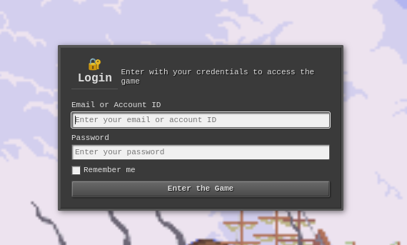
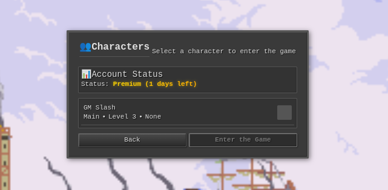

[](https://github.com/edubart/otclient/actions/workflows/build-vcpkg.yml) [](https://gitter.im/edubart/otclient?utm_source=badge&utm_medium=badge&utm_campaign=pr-badge&utm_content=badge) [](https://www.codetriage.com/edubart/otclient)

### OTClient + WebView with Chromium Embedded Framework (CEF)

This is the default OTClient with the addition of a powerful WebView feature. It allows building UI 
components in OTClient using web technologies and is fully compatible with HTML, CSS, and JavaScript.

The WebViews are provided by CEF using OSR (off-screen rendering), which renders the buffer that would
normally be displayed by the browser.

## How to build 

### Ubuntu 24

**Prerequisites:**
- Same procedure as build regular OTClient, but when preparing the build with cmake you need to activate CEF:
  - `cmake -DUSE_CEF=ON ..`
- Download and install CEF. It's needed to be specific version 139.0 (automated script is available `setup_cef.sh`)

### Windows Builds with vcpkg and Visual Studio 2022

**Prerequisites:**
- Visual Studio 2022 with v142 toolset (MSVC 2019 build tools)
- Windows 11 SDK (for CEF build compatibility)
- CMake 3.16+
- Git
- Download and install CEF. It's need to be specifric version 139 (automated PowerShell script is available `setup_cef.ps1`)

**Setup vcpkg:**
```bash
git clone https://github.com/Microsoft/vcpkg.git C:\vcpkg
C:\vcpkg\bootstrap-vcpkg.bat
setx VCPKG_ROOT C:\vcpkg
```

**Create v142 triplet:**
```bash
# Create C:\vcpkg\triplets\x64-windows-v142.cmake
set(VCPKG_TARGET_ARCHITECTURE x64)
set(VCPKG_CRT_LINKAGE dynamic)
set(VCPKG_LIBRARY_LINKAGE dynamic)
set(VCPKG_PLATFORM_TOOLSET v142)
```

**Install dependencies:**
```bash
vcpkg install --triplet=x64-windows-v142
```

**Build:**
```bash
mkdir build && cd build

# For build with OpenGL (wihtout GPU acceleration!)
cmake .. -G "Visual Studio 17 2022" -A x64 -T v142 -DCMAKE_TOOLCHAIN_FILE="%VCPKG_ROOT%/scripts/buildsystems/vcpkg.cmake" -DVCPKG_TARGET_TRIPLET=x64-windows-v142 -DUSE_CEF=ON

# For build with OPENGLES=2.0 (support GPU acceleration)
cmake .. -G "Visual Studio 17 2022" -A x64 -T v142 -DCMAKE_TOOLCHAIN_FILE="%VCPKG_ROOT%/scripts/buildsystems/vcpkg.cmake" -DVCPKG_TARGET_TRIPLET=x64-windows-v142 -DUSE_CEF=ON -DOPENGLES="2.0"

cmake --build . --config RelWithDebInfo --parallel
```

**Note:** The v142 toolset is required for compatibility. VS 2022 defaults to v143 which has linking issues with this project.

## TODO

### Completed

- [x] Basic CEF integration in OTClient
- [x] Basic HTML/CSS rendering
- [x] CEF installation and compilation helpers
- [x] Mouse interaction with the component
- [x] Keyboard interaction with the component
- [x] Performance optimization (texture caching, frame rate control)
- [x] Integrate webviews with otclient filesystem through otclient://
- [x] Basic integration through callbacks between Lua and JS
- [x] Windows builds (vcpkg probably)
- [x] Code readibility (clean-code geeks happy)
- [x] GPU acceleration (Linux is always active, Windows must OPENGLES=2.0)

### Pending

- [ ] Dynamically build components to be expose for webviews on otclient://webviews
- [ ] Touchscreen interaction with the component
- [ ] Support GPU acceleration on Windows when using OpenGL 
- [ ] Implementation (bridge) of all available callbacks/methods in Lua also for JavaScript
- [ ] Developer tools integration (F12 debugger)

### HTTP Login Component

The HTTP Login component demonstrates WebView capabilities by replacing the traditional TCP login with HTTP-based authentication. It supports JWT tokens (if server supports) with fallback to username/password for the final game connection.

**Requirements:**
- [OTClient HTTP Login Server](https://github.com/LeandroPerrotta/otclient-http-login-server) (Node.js application)

**Configuration:**
- Enable/disable in `init.lua`: `useLoginHttp = true/false`
- Configure API URL in `modules/client_http_entergame/http_entergame.lua`: `baseUrl = "https://your-api-url"`


